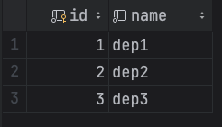
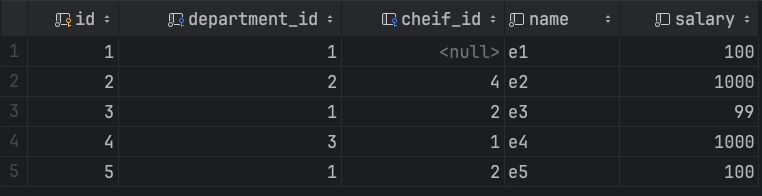

# Исходные данные

## Таблица Org_structure

## Таблица Employee

# Результаты запросов
## Сотрудники с зарплатой не меньше непосредственного начальника
    SELECT e.id, e.name, e.salary, c.id AS chief_id, c.name AS chief_name, c.salary AS chief_salary
    FROM Employee e
    JOIN Employee c ON e.cheif_id = c.id
    WHERE e.salary >= c.salary;

## Департаменты с самой большой суммарной зарплатой сотрудников

    SELECT o.name, SUM(e.salary) AS total_salary
    FROM Org_structure o
    JOIN Employee e ON o.id = e.department_id
    GROUP BY o.name
    ORDER BY total_salary DESC
    LIMIT 3;

